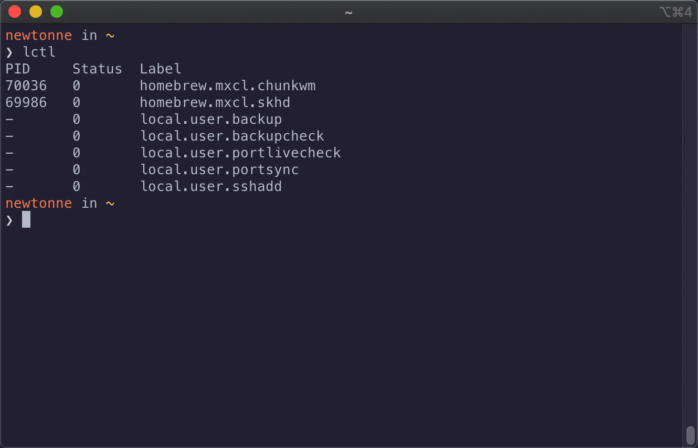

# lctl

User-friendly launchctl wrapper and helper functions

## Features

- Easy CLI management of launchd user agents
- Written in bash and compatible with bash 3.2+ (pre-installed version in macOS)
- Tab-completion support for bash and zsh
- No dependencies required beyond a base macOS install
- Tested on macOS 15 Sequoia but should be compatible with older versions too



## Installation

Clone the repo and copy `lctl` to a directory in your `$PATH` e.g. `/usr/local/bin`:

```sh
git clone git@github.com:newtonne/lctl.git
cd lctl && sudo cp lctl.sh /usr/local/bin/lctl
```

### Installing completion

#### bash

With Homebrew:

```sh
cp completions/lctl.bash $(brew --prefix)/etc/bash_completion.d/lctl
```

With Macports:

```sh
sudo cp completions/lctl.bash $(dirname $(dirname $(which port)))/etc/bash_completion.d/lctl
```

#### zsh

With Homebrew:

```sh
cp completions/_lctl $(brew --prefix)/share/zsh/site-functions
```

With Macports:

```sh
sudo cp completions/_lctl $(dirname $(dirname $(which port)))/share/zsh/site-functions
```

## Usage

```
lctl - user-friendly launchctl wrapper and helper functions

USAGE
    lctl COMMAND AGENT
    lctl list|listdisabled|print
    lctl [-h|--help]

COMMANDS
    cat             Print plist file contents
    edit            Edit plist file in $EDITOR
    file            Print plist file path
    listdisabled    List disabled agents
    log             View logs in $PAGER
    logfiles        Print log file paths
    reload          Shortcut for bootout => bootstrap
    tail            Tail stdout log file

    bootout         Unload the agent
    bootstrap       Load the agent
    disable         Prevent agent from being loaded
    enable          Enable the agent
    kickstart       Execute the agent immediately
    kill            Send SIGTERM to the agent
    list            List all agents or brief agent info
    print           Detailed domain or agent info

    See launchctl(1) for more information on second set of commands.

AGENT
    Case-insensitively glob matched against .plist files in
        ~/Library/LaunchAgents

EXAMPLES
    lctl reload myagent   bootout then bootstrap agent defined in
                              ~/Library/LaunchAgents/*myagent*.plist
    lctl listdisabled     List all disabled launchd user agents
```

## Licensing

This project is licensed under the MIT License - see the [LICENSE](LICENSE) file for details
